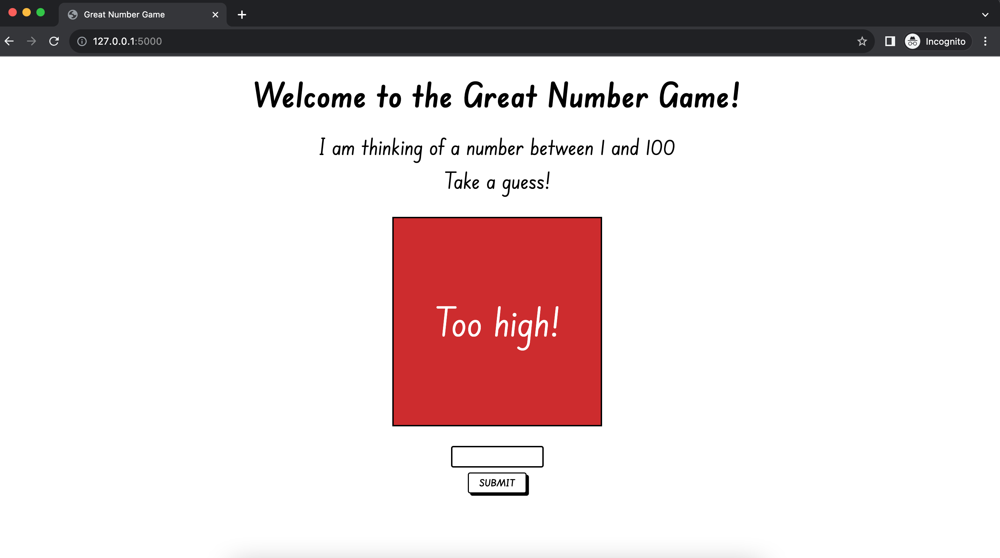

# 🎲 The Great Number Game 🎲

Welcome to **The Great Number Game!** This is a fun and interactive guessing game where the computer picks a random number between 1 and 100, and you have to guess it! 🎉

## Screenshot

## 🚀 Getting Started

### Prerequisites

Make sure you have Flask installed. If not, you can install it using pip:

`pip install flask`

### Running the game

1. Clone the repository to your local machine.
2. Navigate to the project directory in your terminal.
3. Run the application using the command `flask run` or `python server.py`.
4. Open your preferred web browser and navigate to `http://localhost:5000`.
5. Start guessing! 🧠

## 📝 Game Rules

- If your guess is too high, you'll be told to guess lower.
- If your guess is too low, you'll be told to guess higher.
- When you guess the number correctly, the message box will turn green and congratulate you! 🎉
- You can then choose to play again by clicking the "Play again!" button.

## 🛠️ Built With

- [Flask](https://flask.palletsprojects.com/)
- HTML5
- CSS3

Enjoy the game! 😄
